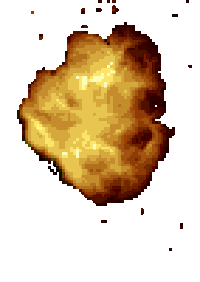
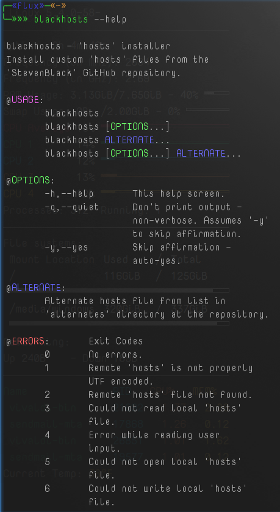
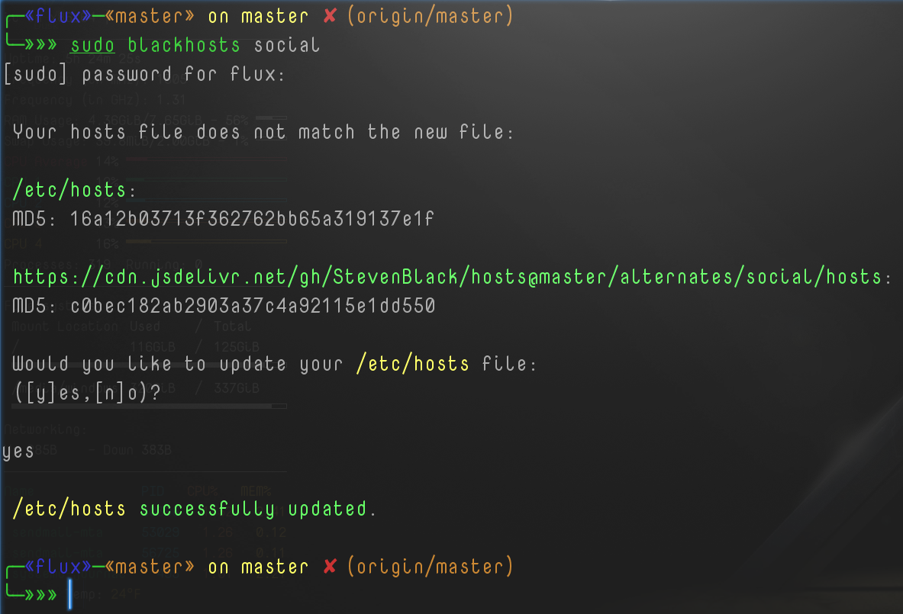

# Black Hosts - Installer



<sup>[[1](#note1)]</sup>

<a class="twitter-share-button"
  href="https://twitter.com/share?ref_src=twsrc%5Etfw&text=%27BlackHosts%27%20-%20Command%20line%20installer%20for%20hosts%20files%20found%20at%20github%2FStevenBlack%0ACross-platform%20for%20%23Windows%2C%20%23Linux%2C%20and%20%23MacOs%20written%20in%20%23RustLang%0A%23Programming%20%23Coding%20via%20%40thefluxapex%0A"></a>

- [Black Hosts - Installer](#black-hosts---installer)
	- [About](#about)
		- [Description](#description)
			- [Disclaimer](#disclaimer)
			- [Environment](#environment)
			- [Cross Platform](#cross-platform)
			- [Steven Black Repository](#steven-black-repository)
			- [Motivation](#motivation)
	- [Usage](#usage)
		- [Testing](#testing)
		- [Deployment](#deployment)
		- [Administrative and Root Usage](#administrative-and-root-usage)
			- [Linux root (sudo)](#linux-root-sudo)
			- [MacOs root (sudo)](#macos-root-sudo)
			- [Windows Administrator](#windows-administrator)
		- [File Permissions](#file-permissions)
		- [Installation](#installation)
			- [Debian Installer](#debian-installer)
				- [Install By (Double) Clicking](#install-by-double-clicking)
				- [Install Command Line Method](#install-command-line-method)
				- [Uninstall Command  Line Method](#uninstall-command--line-method)
			- [Portable Usage](#portable-usage)
				- [Operating System PATH](#operating-system-path)
		- [Environment Usage](#environment-usage)
			- [Operating System Environment](#operating-system-environment)
			- [Command Line Environment](#command-line-environment)
		- [Examples](#examples)
	- [Links](#links)
		- [File Links](#file-links)
		- [Project Links](#project-links)
	- [Project Status](#project-status)
		- [Overall Status](#overall-status)
		- [Latest Version Status](#latest-version-status)
			- [Latest Master Build Status](#latest-master-build-status)
	- [Notes](#notes)
	- [Media](#media)
		- [Logo](#logo)
		- [Screen Shots](#screen-shots)
			- [Help Screen](#help-screen)
			- [Demo Screen](#demo-screen)
	- [LICENSE](#license)

---

## Support Me If You Like

If you like this project and care to donate to my ***PayPal***:

[](https://paypal.me/ianapride?locale.x=en_US)

Or ***Buy Me A Coffee*** if your prefer:

[](https://www.buymeacoffee.com/ianalanpride)

---

## About

### Description

This is a cross-platform **hosts**<sup>[[2](#note2)]</sup> file installer for hosts files found at the [StevenBlack](https://github.com/StevenBlack/hosts)<sup>[[3](#note3)]</sup> repository and uses the *JSDELIVR*<sup>[[4](#note4)]</sup> system to retrieve the files.

#### Disclaimer

I'm in no way related to this project other than being an avid and long time and grateful user of its resources. I wrote this for myself, but if anyone gets good use out of it, well then, all the better.

#### Environment

This is a command line utility written in the *Rust* programming language.

#### Cross Platform

This should work in command lines in **Linux**, **Windows**, & **MacOs**. 

#### Steven Black Repository

<sup>[3]</sup> This repository is a consolidated list of ad, social, phishing, and porn and other types of **hosts**<sup>[[2](#note2)]</sup> files to help block these types of sites.

Visit [https://github.com/StevenBlack/hosts](https://github.com/StevenBlack/hosts) for more information.

This utility is for use with the main **hosts** file at the root of the repo and the *alternates* located in the "*alternates*" folder at the same repository.

If no *alternates* option is passed it defaults to the main root *hosts* file.

#### Motivation

I have quite a few devices/machines that I administrate/maintain and I'm constantly changing the *hosts* files for various reasons and this just makes it to where I can do it *on-the-fly* without having to open a browser or editor or anything. This also makes it to where I can automate this in a root *cronjob* or administrative *task*/*service*.

## Usage

This is a *cross-platform* command line tool in binary executable format that can be used in *command lines*/*consoles*/*terminals*/*ttys*/*shells* in **Linux**, **Windows**, and **MacOs**.

This program's name has various versions, but they should all be renamed to: `blackhosts`.

### Testing

This was written in *Linux*, but tested in *Linux* and *Windows*. Sorry *MacOs* users; I do not have a Mac, but I do know the operating system well and it has been written properly for the system had compiled successfully as can be seen in this repositories build history and should run fine. Please let me know if it doesn't.

### Deployment

This is currently provided as a compiled binary that is either portable or can be installed in *Linux* with the  *Debian* - **`.deb`**<sup>[[5](#note5)]</sup> package installer, but if there's enough interest I can also provide an ***AppImage***<sup>[[6](#note6)]</sup> at some point.

### Administrative and Root Usage

The *hosts* file is always governed and in a place owned by the "*Administrator*" or "*root*" account and therefore this program must be ran as *Administrator* or *root* ("*sudo*").

#### Linux root (sudo)

In *Linux* you can run this as the root account with *root*, *su*, or much more preferably *sudo*:

```Shell
sudo blackhosts
# Or
su -c 'blackhosts'
```

#### MacOs root (sudo)

It should be the exact same methods as the *Linux* methods.

#### Windows Administrator

*Windows* is a bit different as there are three things you have to worry about:
1. It has to be executed from a console, script, or program that has been "*Run As Administrator*".
2. The *hosts* file attributes can not be set to "*read only*" in the file's *properties*.
3. Any Anti-Virus or Malware software that protects the *hosts* file must temporarily be disabled.

### File Permissions

 The main program file is meant to be executable and in *Windows* that's not usually an issue, but in *Linux* and *MacOs* you may need to set the permissions.

 In a *Linux* or *MacOs* command line run:

```Bash
# executable for all users
chmod +x /path/to/blackhosts
# or
chmod 755 /path/to/blackhosts 
# executable for current user only
chmod u+x /path/to/blackhosts 
```

### Installation

This program is portable, but there is a *Debian* (*.deb* file) package installer for the *Linux* binary version.

#### Debian Installer

The file: *blackhosts.deb* is a *Linux Debian* package installer for use on most *Linux Debian* based operating systems.

##### Install By (Double) Clicking

Like many other executable files this should be able to be clicked or double clicked to execute and it should open in the systems software manager gui.

##### Install Command Line Method

Install from command line with:

```Bash
sudo dpkg -i /path/to/blackhosts.deb
```

I imagine this can be installed with *gdebi*, but I'm not familiar with it.

Uninstall with:

##### Uninstall Command  Line Method

```Bash
sudo apt remove blackhosts
# -y to skip prompt approval
```

#### Portable Usage

Portable applications do not need to be installed, but they are easier to use if they are in one of a systems `PATH` directories.

If the program file is not in `PATH` (or in the current directory) then you must run it with the complete path url:

```Shell
/path/to/blackhosts --help
```

or

```PowerShell
& '\Path\To\blackhosts.exe' --help
```

If the file is place in `PATH` then you can run it with:

```Shell
blackhosts --help
```

##### Operating System PATH

`PATH` directories are stored and can listed in the various operating systems `PATH` variable.

E.g.
```Shell
echo "$PATH"
```

|Operating System|Variable Name|
|:---:|:---:|
|Linux|$PATH|
|MacOs|$PATH|
|Windows|%PATH%|

### Environment Usage

Used in many command lines across 3 main operating systems (and more). 

#### Operating System Environment

3 main operating systems:

- Linux
- Windows
- MacOs

#### Command Line Environment

Used in any command line environment from *Linux Shell* to *Windows PowerShell*.

- Windows
  - CMD
  - PowerShell
- Linux
  - Shell
  - Bash
  - Zsh
  - many more...
- MacOs
  - Same as Linux I imagine.

### Examples

Install or update to the "normal" *hosts* file:

```Shell
 $ sudo blackhosts

 Your hosts file does not match the new file:

 /etc/hosts:
 MD5: d41d8cd98f00b204e9800998ecf8427e

 https://cdn.jsdelivr.net/gh/StevenBlack/hosts@master/hosts:
 MD5: 4a20dc26d106bba609308a4a91be1eea

 Would you like to update your /etc/hosts file:
 ([y]es,[n]o)?

yes

 /etc/hosts successfully updated.

```

Install or update to the "social" *hosts* file:

```Shell
 $ sudo blackhosts social
[sudo] password for flux:

 Your hosts file does not match the new file:

 /etc/hosts:
 MD5: 4a20dc26d106bba609308a4a91be1eea

 https://cdn.jsdelivr.net/gh/StevenBlack/hosts@master/alternates/social/hosts:
 MD5: c0bec182ab2903a37c4a92115e1dd550

 Would you like to update your /etc/hosts file:
 ([y]es,[n]o)?

yes

 /etc/hosts successfully updated.

```

Install while skipping affirmation prompt:

```Shell
 $ sudo blackhosts --yes

 /etc/hosts successfully updated.

```

Help:

```Shell
 $ blackhosts --help

 blackhosts - 'hosts' installer
 Install custom 'hosts' files from the
 'StevenBlack' GitHub repository.

 @USAGE:
	blackhosts
	blackhosts [OPTIONS...]
 	blackhosts ALTERNATE...
 	blackhosts [OPTIONS...] ALTERNATE...

 @OPTIONS:
	-h,--help	This help screen.
	-q,--quiet	Don't print output -
		                non-verbose. Assumes '-y'
		                to skip affirmation.
	-y,--yes	Skip affirmation -
		                auto-yes.

 @ALTERNATE:
 	Alternate hosts file from list in
	'alternates' directory at the repository.

 @ERRORS:	Exit Codes
	0	No errors.
	1	Remote 'hosts' is not properly
	        UTF encoded.
	2	Remote 'hosts' file not found.
	3	Could not read local 'hosts'
	        file.
	4	Error while reading user
	        input.
	5	Could not open local 'hosts'
	        file.
	6	Could not write local 'hosts'
	        file.

```

## Links

All links pertinent to this project. 

All of the most current, up-to-date files are located on the 'Stable Release' page.

### File Links

[](https://github.com/Lateralus138/blackhosts/releases/tag/1.0.109134)

### Project Links

Current project links.

|Description|Link|
|:---|:---|
|Main repository.|[https://github.com/Lateralus138/blackhosts](https://github.com/Lateralus138/blackhosts)|
|Main repository - themed version.|[https://lateralus138.github.io/blackhosts](https://lateralus138.github.io/blackhosts)|
|Current Releases|[https://github.com/Lateralus138/blackhosts/releases](https://github.com/Lateralus138/blackhosts/releases)|
|Stable Release|[https://github.com/Lateralus138/blackhosts/releases/tag/1.0.109134](https://github.com/Lateralus138/blackhosts/releases/tag/1.0.109134)|

## Project Status

### Overall Status


|Description|Status|
|:---:|:---:|
|Project Release Date||
|Total downloads for this project||
|Complete repository size||
|Commits in last month||
|Commits in last year||

### Latest Version Status

|Description|Status|Number of Downloads|
|:---:|:---:|:---:|
|Latest Release version|||
|Latest Tag version, possible Pre-Release's|||

#### Latest Master Build Status

|Name|Status|MD5|
|:---:|:---:|:---:|
|Code Quality||NA|
|Linux: `Build`/`Publish`|||
|Debian: `Build`/`Publish`|||
|Windows: `Build`/`Publish`|||
|MacOS: `Build`/`Publish`|||

<!-- #### Latest Branch Build Status

**NOTE**:These are generated with my original workflow from the secondary relative branches of this repository. These will soon be discontinued in favor of files wtih a different versioning system. The current files will be a *`Continuous Build`* and each version of the continuous build will also have a second archive versioning with a number system<sup>[see example below]</sup> based on the year multiplied by the numbered day of that year.

New Archive Version Example: `v1.0.109134`

|1st #|2nd #|3rd #|
|:---:|:---:|:---:|
|1|0|109134|
|Main Version|Update Version|Revision Version|
|Main version number - rewrite, rare.|Updates, fixes, and refactor version number.|Day of latest version calulated by the current year multiplied by the current day of the year: 2021 * 54 (today is the 54th day of 2021).|

|Name|Status|Code Quality|
|:---:|:---:|:---:|
|Linux: `Build`/`Publish`|||
|Debian: `Build`/`Publish`|||
|Windows: `Build`/`Publish`|||
|Macos: `Build`/`Publish`||| -->

## Notes

|#|Description|Link|
|---:|:---:|:---:|
|<sup>1</sup><a name="note1"></a>|This image is part of the logo found at the Steven Black repository; it is not my stock, but I did render and edit this cut.|[Stock Logo Home](https://raw.githubusercontent.com/StevenBlack/hosts/master/.github/logo.png)|
|<sup>2</sup><a name="note2"></a>|The *hosts* file is found on any device that connects to the internet and needs to resolve website host names to IP's.|[DuckDuckGo Search](https://duckduckgo.com/?q=what+is+the+hosts+file&t=vivaldi&ia=web)|
|<sup>3</sup><a name="note3"></a>|This is the repository that hosts all the "*hosts*" files that can be installed with this installer. The default file is at the root of the repository and any alternates are in the "alternates" folder. The name of the *alternative* is the name of the corresponding internal folders within the "alternates" folder. See the repository for a better understanding and more information. |[Steven Black - hosts - Repository](https://github.com/StevenBlack/hosts)|
|<sup>4</sup><a name="note4"></a>|*JSDELIVR* is a common file delivery system for files hosted at *GitHub*.|[JSDELIVR WebSite](https://www.jsdelivr.com)|
|<sup>5</sup><a name="note5"></a>|The Debian `.deb` file is a Linux application package installer/delivery system.|[DuckDuckGo Search](https://duckduckgo.com/?q=what+is+a+Debian+.deb+file&t=vivaldi&ia=web)|
|<sup>6</sup><a name="note6"></a>|*AppImage* is a portable executable system with sand-boxing capabilities and no need to worry about dependencies. There isn't much need to have an *AppImage* with this seeing that it has no dependencies, but if anyone wants it I will considering creating one.|[DuckDuckGo Search](https://duckduckgo.com/?q=what+is+an+AppImage+file&t=vivaldi&ia=web)|

## Media

**DISCLAIMER**: Not my stock work as stated before.

### Logo


### Screen Shots

#### Help Screen



#### Demo Screen



## [LICENSE](./LICENSE)


>This program is free software: you can redistribute it and/or modify it under the terms of the GNU General Public License as published by the Free Software Foundation, either version 3 of the License, or (at your option) any later version.

>This program is distributed in the hope that it will be useful, but WITHOUT ANY WARRANTY; without even the implied warranty of MERCHANTABILITY or FITNESS FOR A PARTICULAR PURPOSE.  See the GNU General Public License for more details.
